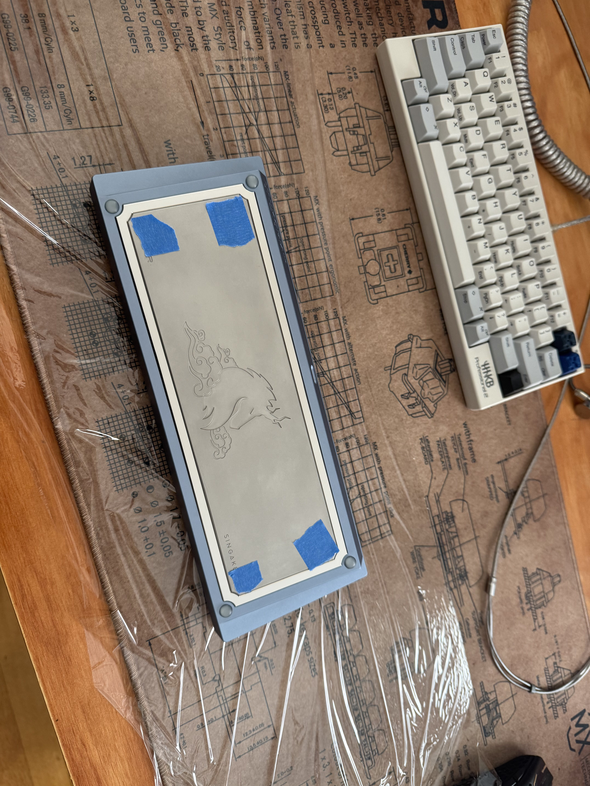
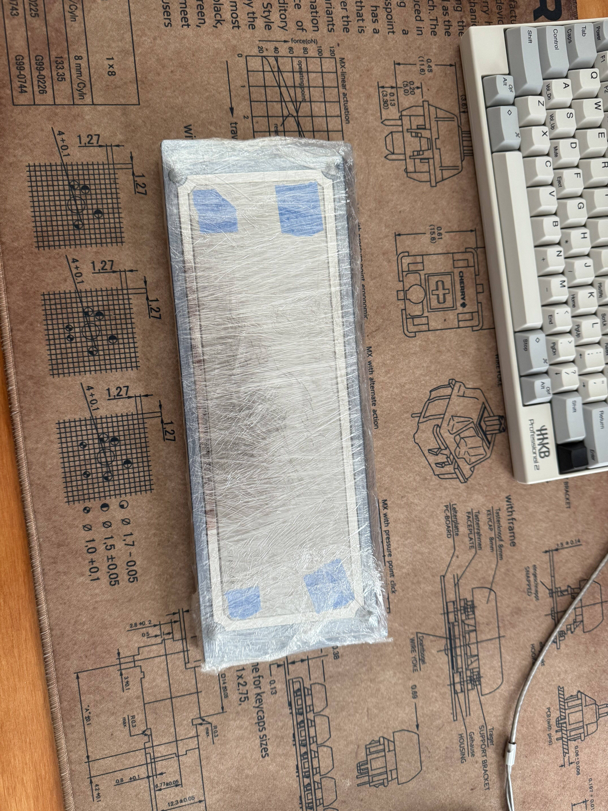
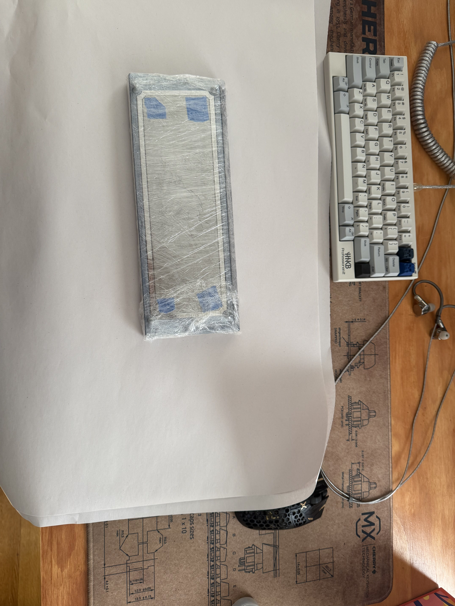
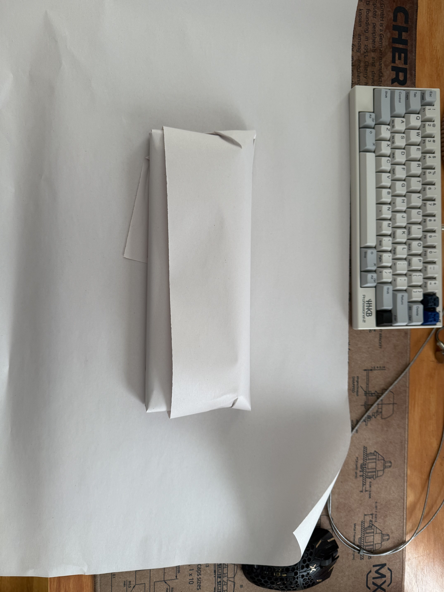
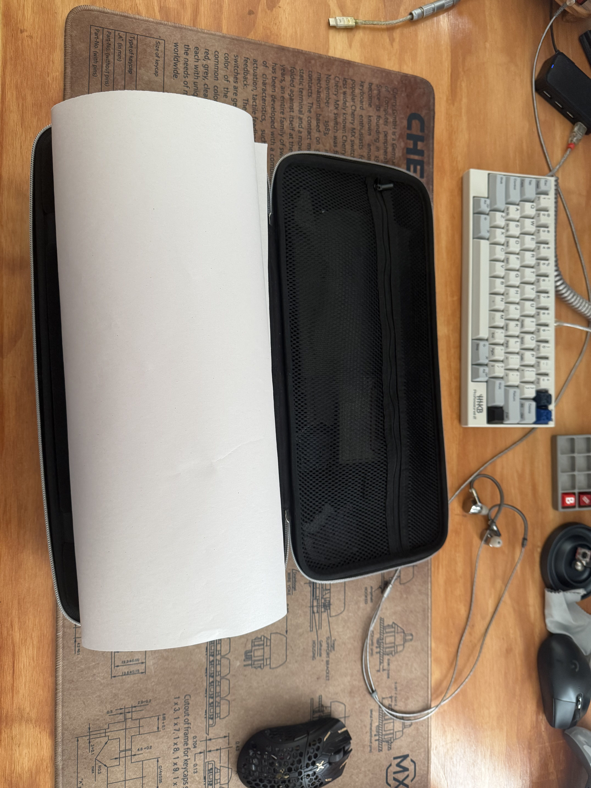
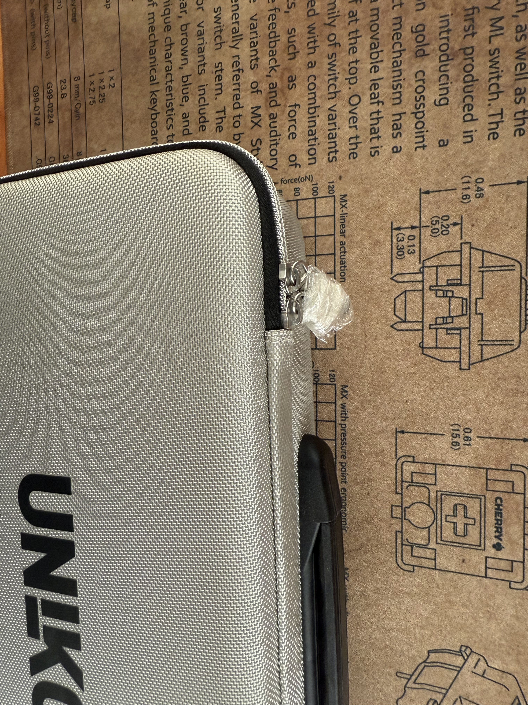
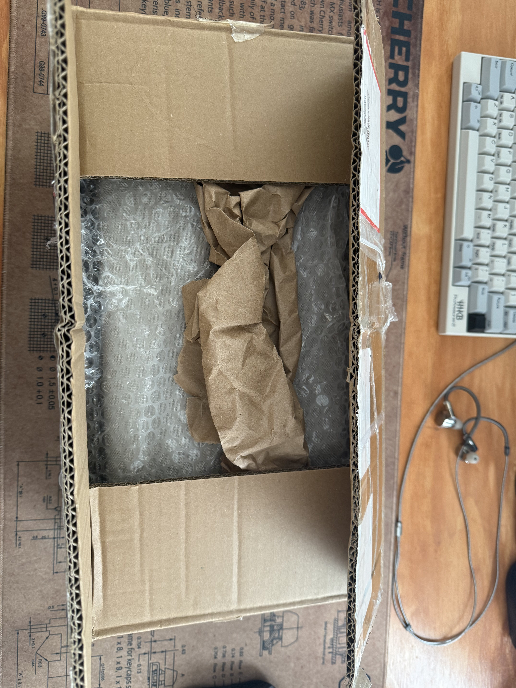
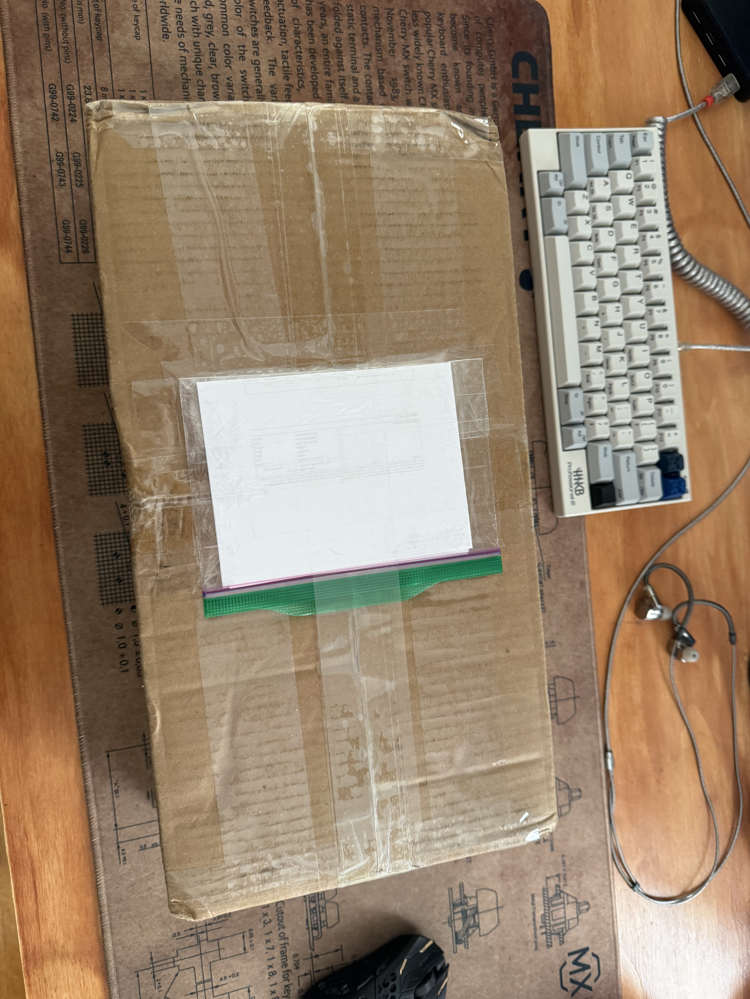

# Mechanical Keyboard Packing and Shipping Guide

---

### Tutorial written by @Ladb
> - [Discord](discord.gg/Ladb)
> - [YouTube](https://www.youtube.com/channel/UCnJrj0XylSQQ-bjrutL2xOA)
> - [Twitch.tv](https://www.twitch.tv/ladbee)

This guide walks you through carefully packaging and shipping your mechanical keyboard to ensure it arrives safely—especially helpful for high-value boards. Follow each step to pack like a pro!

---

## Step 1: Cover Exposed Screws
- Use **painter’s tape** to cover any exposed screws on the board. This prevents scratches and protects the finish.

## Step 2: Clean Delicate Finishes
- If the board has a **PVD finish**, use a **new microfiber cloth** to wipe it down. This removes any fingerprints or dust before packing.

## Step 3: Saran Wrap Layers
1. Start with a **first layer of saran wrap** around the keyboard.

2. Add **2–3 more layers of saran wrap** for extra protection. 

3. **Tip:** Poke small holes on the keycap side with a tack or similar tool. Allowing the package to "breathe" can prevent discoloration from trapped air, especially with certain keycap materials.

## Step 4: Wrap in Paper
- **Wrap the keyboard in 2 layers of paper** to add another protective layer.

## Step 5: Use a Cloth Bag
- Place the board in a **cloth bag** to keep it safe from scratches or scuffs.

## Step 6: Place in a Carry Case
- Put the keyboard in a secure **carry case**. This provides additional structure and padding.

## Step 7: Extra Protection for the Top of the Case
- Place **one sheet of paper on top of the keyboard** in the case. This will protect it from any extras (e.g., metal plates or cards) that might be stored on top.

## Step 8: Secure the Zipper
- **Tape the zipper** of the carry case to ensure it doesn’t accidentally open during shipping.

## Step 9: Pack Securely in the Box
1. Place the carry case in the shipping box with plenty of padding on all sides to prevent movement.

2. **Shake Test**: Lift and gently shake the box. If you hear movement, add more padding until the keyboard is completely secure.

## Step 10: Reinforce the Box’s Crease (Optional)
- Roll up some paper and place it along the **center crease of the box** to prevent the box from folding inward if pressure is applied during transit.

## Step 11: Attach Invoice (for International Shipping)
- Use a **sealed ziplock bag** for your invoices. Push the air out, fold the invoices toward the zip, and tape it securely to the box’s exterior. Add an extra piece of tape over the bag’s opening so customs can easily remove it.

---

Following these steps will protect your keyboard from damage, ensuring it arrives safely and in perfect condition.

*This tutorial brought to you by Ladbee Streaming Associates Discord*
